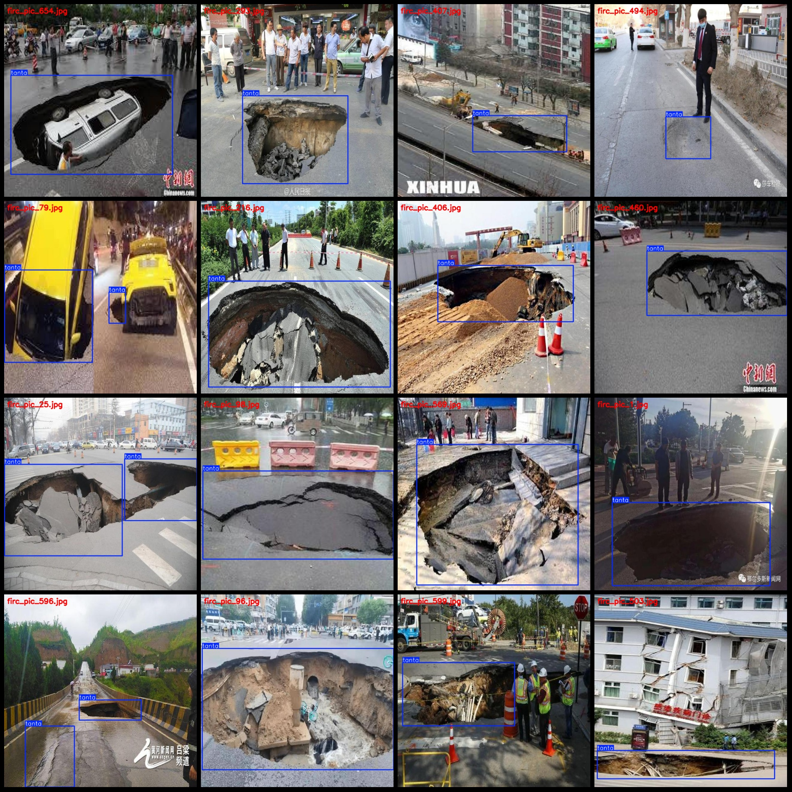
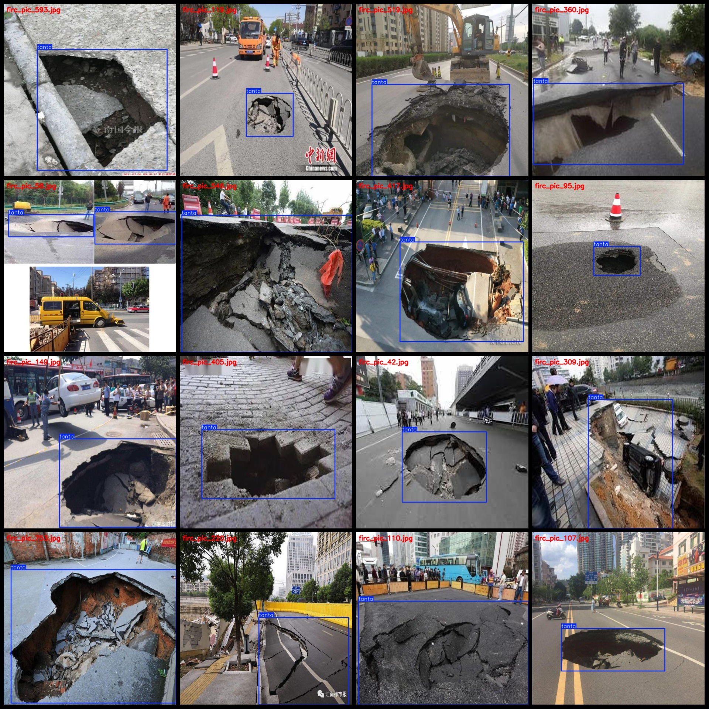

# Smart Traffic Road Deformation Detection Dataset - Pascal VOC + YOLO Format (768 Images, 1 Class)

**Dataset Format:** Pascal VOC format + YOLO format (without split paths in the txt file, only containing jpg images along with corresponding VOC format xml files and YOLO format txt files)

**Number of Images (jpg Files):** 768
**Number of Annotated Files (xml Files):** 768
**Number of Annotated Files (txt Files):** 768
**Number of Annotated Categories:** 1
**Annotated Category Name:** "tanta"
**Total Boxes per Category:** 817
**Total Boxes:** 817
**Each Category's Image Count:** 768
**Image Resolution:** 640x640
**Annotation Tool Used:** labelImg
**Annotation Rules:** Draw a box around the category
**Important Note:** The dataset does not have been split into training, validation, or test sets. You need to divide it yourself.
**Special Remark:** This dataset does not guarantee the accuracy of the trained model or weight files.

**Annotated Example:**

## Images

Here is a pay link on Stripe ( https://buy.stripe.com/3cs8yP7sY87d0vu9AB ). Please contact me lonlonago@foxmail.com after funding $89, and I will send you a complete data files , thank you!

